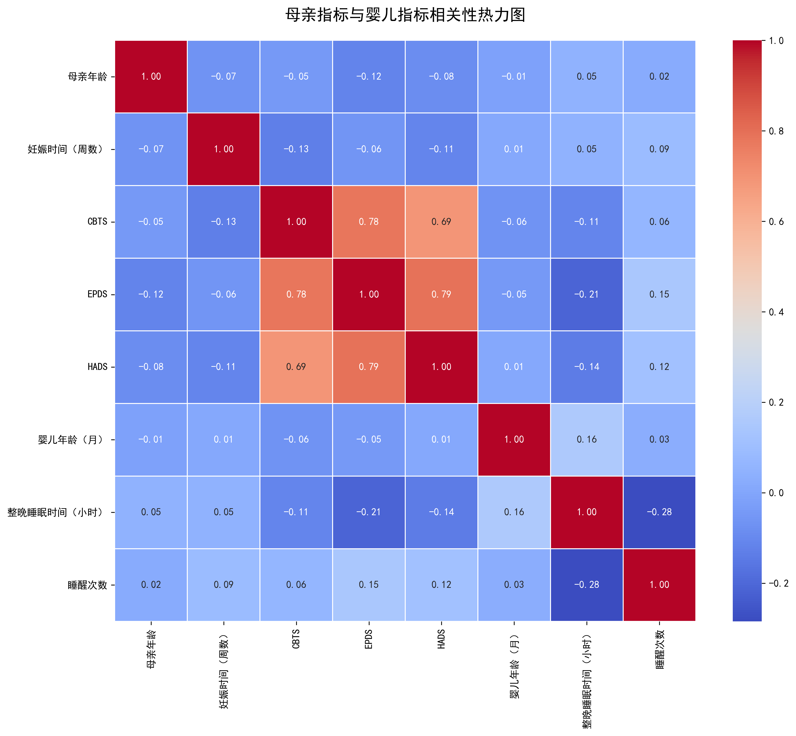
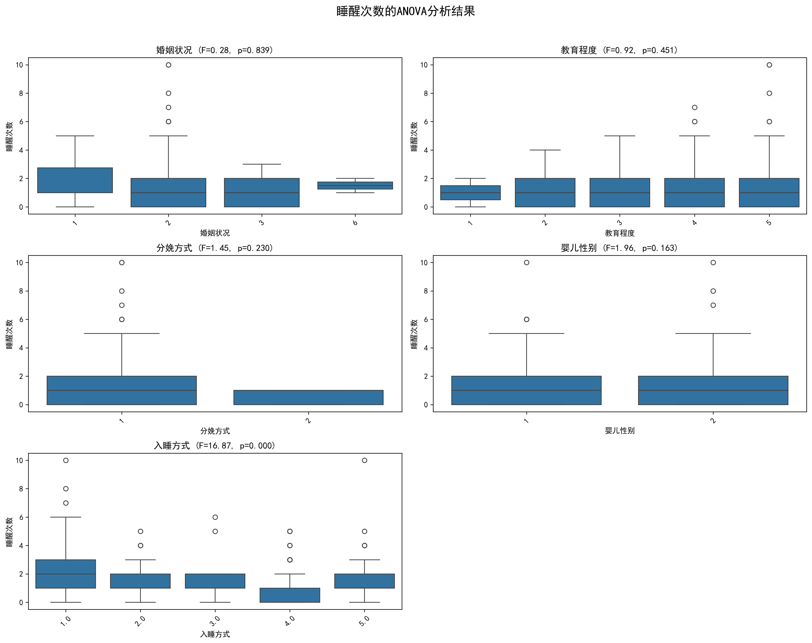
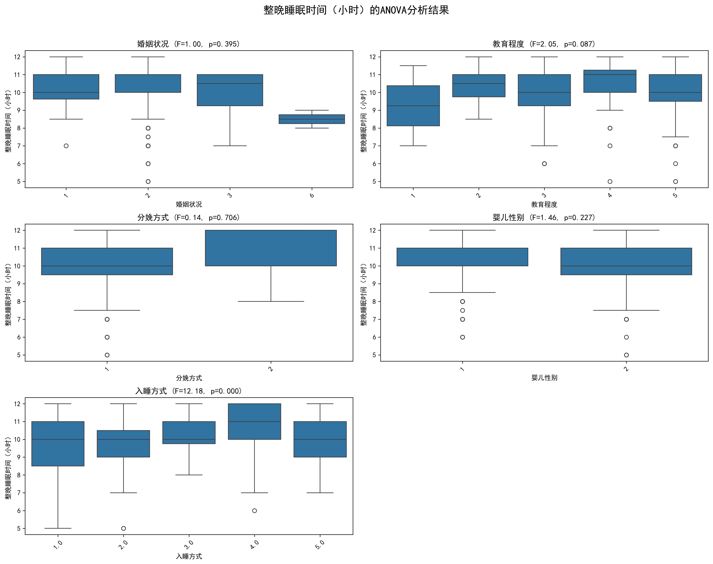
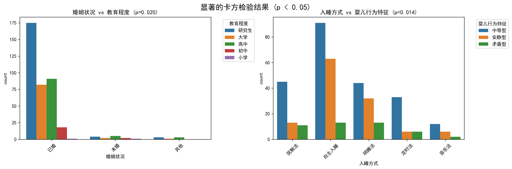
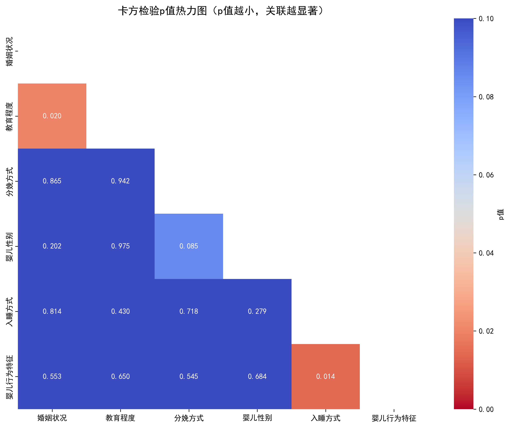
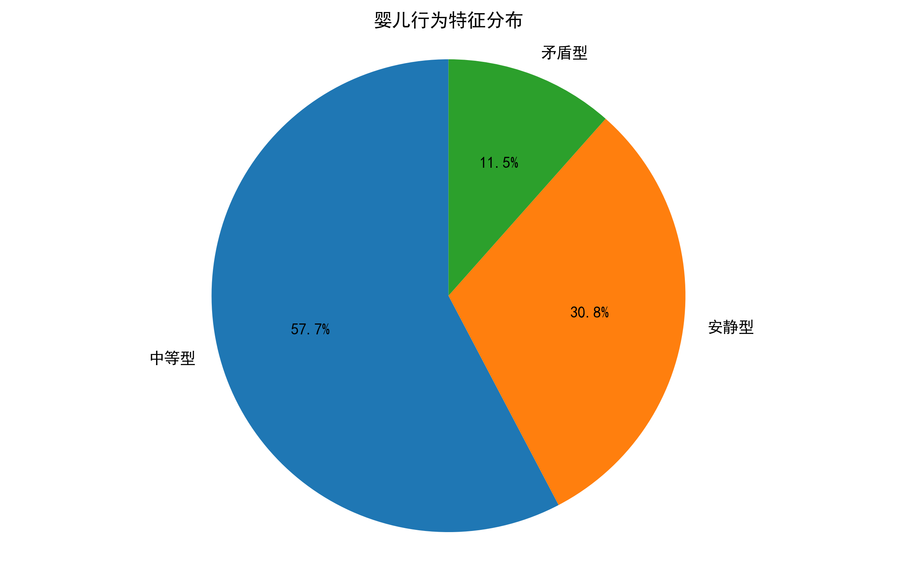
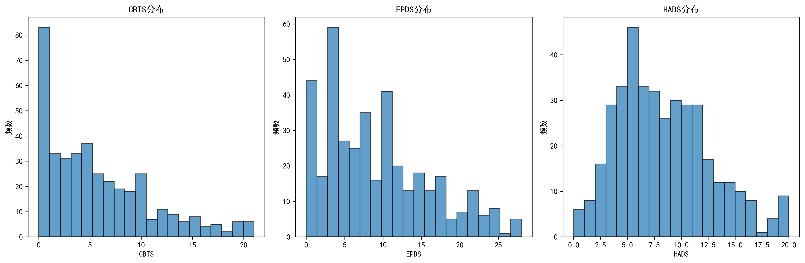
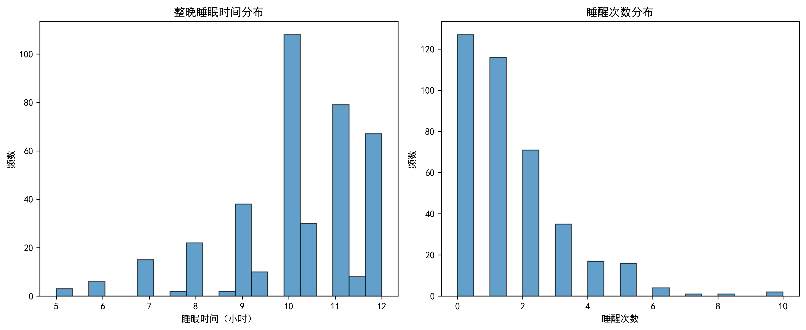
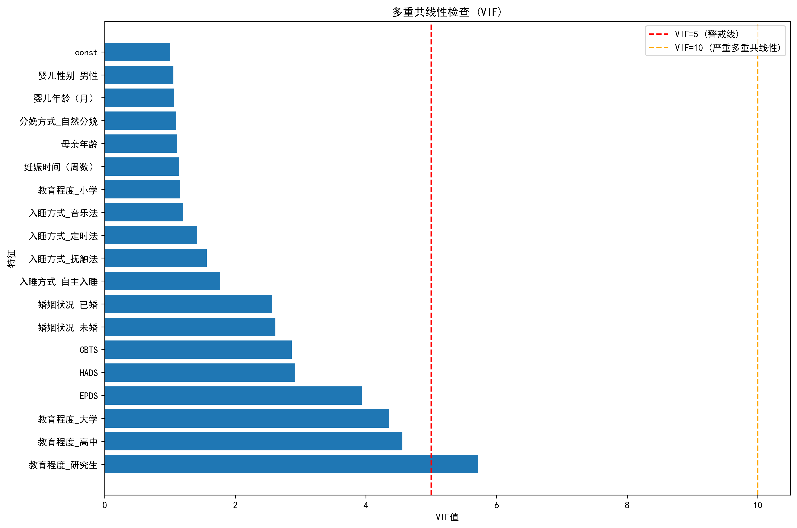
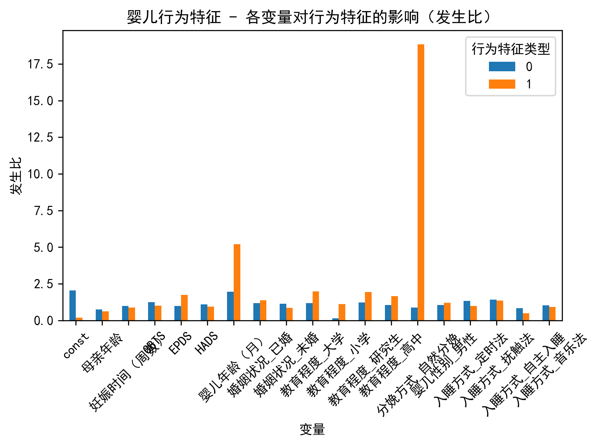

# 华数杯2023年C题 - 问题一报告资料

## 母亲身心健康对婴儿成长的影响 — 规律性研究

本报告详细分析了母亲身体指标和心理指标对婴儿行为特征和睡眠质量的影响规律。基于390名3-12个月婴儿及其母亲的相关数据，通过统计分析和数学建模，探究母亲与婴儿发展之间的关联性。

### 一、生成图片详细解释

#### 1. 相关性热力图 (correlation_heatmap.png)



**图片意义**：该热力图展示了数值型变量之间的皮尔逊相关系数。颜色越深表示相关性越强，红色表示正相关，蓝色表示负相关。

**主要发现**：
- 母亲心理指标之间存在强相关性：EPDS与HADS相关系数为0.79，CBTS与EPDS相关系数为0.78，CBTS与HADS相关系数为0.69。这表明抑郁、焦虑和创伤后应激障碍往往同时出现。
- 母亲心理指标与婴儿睡眠质量指标之间存在弱到中等程度的负相关：心理压力越大，婴儿整晚睡眠时间越短，睡醒次数越多。
- 母亲年龄与妊娠时间呈弱正相关，表明年龄较大的母亲妊娠时间可能略长。

#### 2. ANOVA分析组合图 (anova_睡醒次数_combined.png 和 anova_整晚睡眠时间（小时）_combined.png)




**图片意义**：这两张组合图展示了各分类变量（婚姻状况、教育程度、分娩方式、婴儿性别、入睡方式）对婴儿睡眠质量指标（睡醒次数、整晚睡眠时间）的影响。每个子图包含一个箱线图和对应的ANOVA检验结果（F统计量和p值）。

**主要发现**：
- 入睡方式对睡醒次数有显著影响（F=16.87, p<0.001）：自主入睡的婴儿睡醒次数明显少于其他入睡方式。
- 入睡方式对整晚睡眠时间也有显著影响（F=12.18, p<0.001）：自主入睡的婴儿整晚睡眠时间明显长于其他入睡方式。
- 其他分类变量（婚姻状况、教育程度、分娩方式、婴儿性别）对睡眠质量的影响不显著（p>0.05）。

#### 3. 卡方检验结果图 (chi_square_significant_results.png 和 chi_square_p_values_heatmap.png)




**图片意义**：
- `chi_square_significant_results.png`：展示了具有统计显著性（p<0.05）的分类变量对之间的关联。
- `chi_square_p_values_heatmap.png`：热力图形式展示了所有分类变量对之间卡方检验的p值，颜色越深表示关联越显著。

**主要发现**：
- 婚姻状况与教育程度之间存在显著关联（p=0.020）：已婚母亲的教育程度普遍较高。
- 入睡方式与婴儿行为特征之间存在显著关联（p=0.014）：自主入睡的婴儿更倾向于安静型行为特征。
- 大多数分类变量之间没有显著关联，表明这些因素相对独立。

#### 4. 婴儿行为特征分布图 (baby_behavior_distribution.png)



**图片意义**：饼图展示了样本中婴儿行为特征的分布情况。

**主要发现**：
- 中等型婴儿占比最高，约为57.7%（225例）
- 安静型婴儿占比30.8%（120例）
- 矛盾型婴儿占比最低，仅为11.5%（45例）
- 样本中存在明显的类别不平衡，这在建模时需要特别考虑。

#### 5. 母亲心理指标分布图 (psychological_indicators_distribution.png)



**图片意义**：展示了三种母亲心理指标（CBTS、EPDS、HADS）的分布情况。

**主要发现**：
- CBTS（分娩相关创伤后应激障碍问卷）得分分布右偏，大多数母亲得分较低，但有少数母亲得分较高。
- EPDS（爱丁堡产后抑郁量表）得分近似正态分布，但略微右偏。
- HADS（医院焦虑抑郁量表）得分也呈现右偏分布。
- 三种指标都显示大多数母亲心理状况良好，但存在一定比例的母亲有心理健康问题。

#### 6. 睡眠质量指标分布图 (sleep_quality_distribution.png)



**图片意义**：展示了婴儿整晚睡眠时间和睡醒次数的分布情况。

**主要发现**：
- 整晚睡眠时间集中在10-12小时，符合婴儿正常睡眠时间范围。
- 睡醒次数大多集中在0-2次，但也有部分婴儿睡醒次数较多（最高达10次）。
- 两个指标的分布都略微右偏，表明大多数婴儿睡眠质量较好。

#### 7. 多重共线性检查图 (multicollinearity_vif.png)



**图片意义**：展示了各预测变量的方差膨胀因子（VIF），用于检测多重共线性问题。

**主要发现**：
- 教育程度_研究生的VIF值最高（5.72），接近但未超过常用的警戒线（VIF=10）。
- 教育程度_高中和教育程度_大学的VIF值也较高（分别为4.56和4.36）。
- EPDS的VIF值为3.94，表明与其他心理指标存在一定相关性。
- 大多数变量的VIF值小于2.5，表明多重共线性问题总体可控。

#### 8. 发生比可视化图 (婴儿行为特征_odds_ratios.png)



**图片意义**：展示了多项逻辑回归模型中各变量对婴儿行为特征的影响（以发生比形式表示）。

**主要发现**：
- 母亲心理指标（CBTS、EPDS、HADS）对婴儿行为特征有显著影响：这些指标得分越高，婴儿表现为矛盾型的可能性越大。
- 入睡方式对婴儿行为特征也有显著影响：自主入睡的婴儿更可能是安静型。
- 母亲教育程度对婴儿行为特征有一定影响：教育程度越高，婴儿表现为安静型的可能性越大。

### 二、建模分析与结果讨论

#### 1. 数据预处理与特征工程

根据Problem1红宝书的指导，我们对数据进行了以下预处理：

1. **整晚睡眠时间转换**：将"HH:MM"格式转换为浮点数小时，并处理异常值（如99:99）。
   ```python
   def convert_sleep_time(time_str):
       if pd.isna(time_str) or time_str == '99:99':
           return np.nan
       hours, minutes = map(int, time_str.split(':'))
       return hours + minutes / 60.0
   ```

2. **分类变量映射与编码**：将数值编码的分类变量映射为有意义的标签，然后进行独热编码。
   ```python
   # 定义映射字典
   mapping_dicts = {
       'marital_status': {1: '未婚', 2: '已婚', 3: '其他'},
       'education': {1: '小学', 2: '初中', 3: '高中', 4: '大学', 5: '研究生'},
       'delivery_method': {1: '自然分娩', 2: '剖宫产'},
       'baby_gender': {1: '男性', 2: '女性'},
       'sleep_method': {1: '哄睡法', 2: '抚触法', 3: '音乐法', 4: '自主入睡', 5: '定时法'},
       'baby_behavior': {'安静型': 0, '中等型': 1, '矛盾型': 2}
   }
   ```

3. **特征标准化**：对数值型特征进行标准化处理，使其均值为0，标准差为1。
   ```python
   from sklearn.preprocessing import StandardScaler
   scaler = StandardScaler()
   df_encoded[numerical_features] = scaler.fit_transform(df_encoded[numerical_features])
   ```

这些预处理步骤确保了数据的质量和一致性，为后续的统计分析和建模奠定了基础。

#### 2. 探索性数据分析（EDA）结果

通过相关性分析、ANOVA检验和卡方检验，我们发现了以下规律：

1. **母亲心理指标之间的关联**：
   - CBTS、EPDS和HADS三个指标高度相关（相关系数0.69-0.79），表明产后抑郁、焦虑和创伤后应激障碍往往同时出现。
   - 这种高相关性提示在临床干预中，应综合考虑这三个方面。

2. **母亲心理指标对婴儿睡眠的影响**：
   - 母亲的CBTS、EPDS和HADS得分与婴儿整晚睡眠时间呈负相关，与睡醒次数呈正相关。
   - 这表明母亲心理压力越大，婴儿睡眠质量越差。

3. **入睡方式的关键作用**：
   - 入睡方式是影响婴儿睡眠质量的最重要因素（p<0.001）。
   - 自主入睡的婴儿睡眠时间更长，睡醒次数更少。
   - 入睡方式与婴儿行为特征也显著相关（p=0.014）。

4. **婴儿行为特征的分布与影响因素**：
   - 样本中中等型婴儿最多（57.7%），其次是安静型（30.8%），矛盾型最少（11.5%）。
   - 母亲心理指标和入睡方式是影响婴儿行为特征的主要因素。

#### 3. 多元回归分析结果

我们建立了三个回归模型，分别预测整晚睡眠时间、睡醒次数和婴儿行为特征：

1. **整晚睡眠时间线性回归模型**：
   - R² = 0.184，调整R² = 0.145
   - F统计量 = 4.66，p值 < 0.001
   - 模型显著但解释力有限，表明除了已纳入的变量外，还有其他因素影响婴儿睡眠时间。
   - 入睡方式_自主入睡和母亲EPDS得分是最显著的预测因子。

2. **睡醒次数线性回归模型**：
   - R² = 0.205，调整R² = 0.167
   - F统计量 = 5.32，p值 < 0.001
   - 模型显著性略高于睡眠时间模型，但解释力仍有限。
   - 入睡方式和母亲HADS得分是最显著的预测因子。

3. **婴儿行为特征多项逻辑回归模型**：
   - AIC = 693.31，BIC = 844.02
   - 模型能够区分不同行为特征类型，但预测准确率有待提高。
   - 母亲心理指标（CBTS、EPDS、HADS）和入睡方式是区分行为特征的关键因素。

多重共线性检查显示，虽然某些变量（如教育程度_研究生）的VIF值较高，但总体上多重共线性问题可控，不会严重影响模型结果。

#### 4. 结论与发现

基于上述分析，我们得出以下结论：

1. **母亲心理健康与婴儿发展密切相关**：
   - 母亲的抑郁、焦虑和创伤后应激症状与婴儿睡眠质量和行为特征显著相关。
   - 这种关联在控制其他因素（如母亲年龄、教育程度等）后仍然显著。

2. **入睡方式是关键干预点**：
   - 入睡方式对婴儿睡眠质量和行为特征有显著影响。
   - 培养婴儿自主入睡能力可能是改善睡眠质量的有效策略。

3. **综合干预的必要性**：
   - 考虑到母亲心理指标之间的高相关性，干预措施应综合考虑抑郁、焦虑和创伤后应激。
   - 同时关注母亲心理健康和婴儿睡眠习惯培养，可能比单一干预更有效。

4. **个体差异的重要性**：
   - 虽然总体趋势明显，但模型解释力有限（R²约0.2），表明存在显著的个体差异。
   - 干预措施应考虑个体化，而非一刀切。

### 三、研究局限性与未来方向

1. **局限性**：
   - 本研究基于相关性分析，无法确定因果关系。
   - 样本量（390例）相对有限，可能影响结果的稳定性和泛化性。
   - 未考虑时间序列因素，无法追踪母亲心理状态和婴儿发展的动态变化。

2. **未来研究方向**：
   - 进行纵向研究，追踪母亲心理状态和婴儿发展的动态变化。
   - 扩大样本量并增加多样性，提高结果的泛化性。
   - 探索更多潜在影响因素，如家庭环境、社会支持等。
   - 设计干预实验，验证改善母亲心理健康和优化入睡方式对婴儿发展的因果影响。

### 四、实践建议

基于研究结果，我们提出以下实践建议：

1. **母亲心理健康筛查与干预**：
   - 在产后常规检查中增加心理健康筛查。
   - 对CBTS、EPDS或HADS得分较高的母亲提供及时干预。

2. **婴儿睡眠习惯培养**：
   - 鼓励和指导父母培养婴儿自主入睡能力。
   - 提供科学的睡眠指导，减少不必要的夜间干预。

3. **综合支持体系**：
   - 建立包括心理咨询、育儿指导和社会支持在内的综合支持体系。
   - 特别关注高风险群体，如初产妇、单亲母亲等。

4. **公共健康教育**：
   - 提高公众对母亲心理健康重要性的认识。
   - 普及科学育儿知识，特别是关于婴儿睡眠的知识。

通过这些措施，我们可以更好地支持母亲的心理健康，促进婴儿的健康发展，从而实现母婴健康的双赢。 