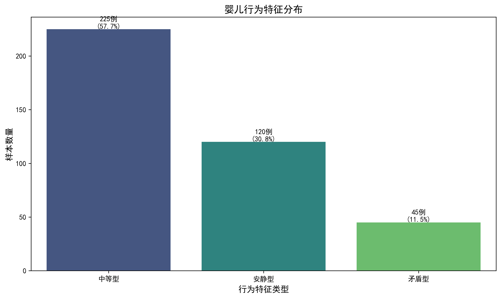
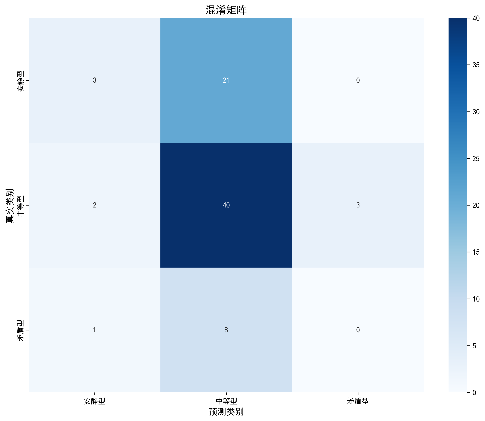
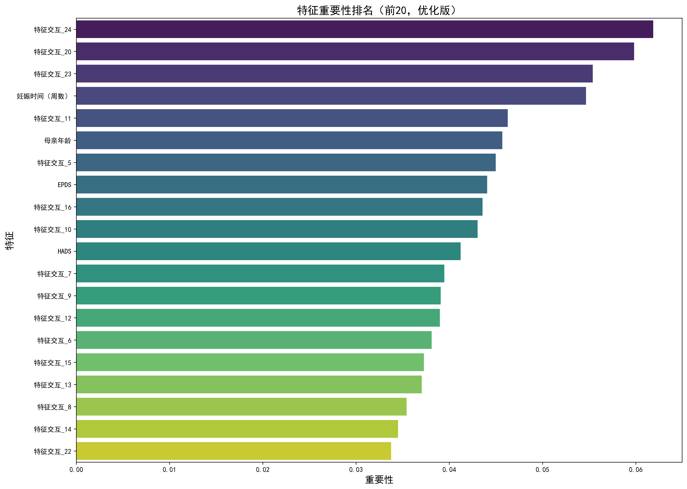
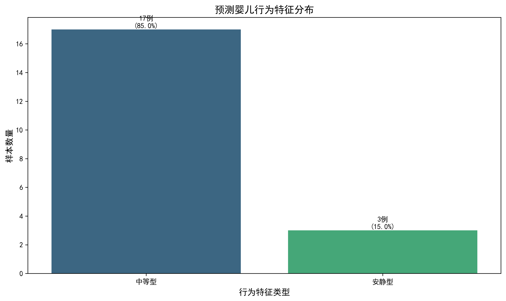

# 华数杯2023年C题 - 问题二报告资料

## 婴儿行为特征分类与预测模型分析

本报告详细分析了婴儿行为特征与母亲身体指标和心理指标之间的关系模型。基于390名3至12个月婴儿及其母亲的数据，通过机器学习方法构建了预测模型，并对编号391-410号的婴儿行为特征进行了预测。

### 一、模型构建与红宝书对照分析

#### 1. 数据预处理部分

**红宝书要求**：
- 将原始数据转换为适用于机器学习模型的结构和格式
- 划分训练集与预测集
- 目标变量编码（安静型→0，中等型→1，矛盾型→2）
- 类别分布分析
- 特征类型分类和转换（数值型和类别型）

**代码实现**：
```python
def load_data(self):
    # 加载数据
    df = pd.read_csv(self.config.DATA_PATH)
    
    # 分离训练集和预测集
    train_df = df[df['婴儿行为特征'].notna() & (df['婴儿行为特征'] != '')]
    predict_df = df[df['婴儿行为特征'].isna() | (df['婴儿行为特征'] == '')]
    
    # 提取特征和标签
    X_train = train_df[['母亲年龄', '婚姻状况', '教育程度', '妊娠时间（周数）', 
                       '分娩方式', 'CBTS', 'EPDS', 'HADS']]
    y_train = train_df['婴儿行为特征']
```

**分析**：代码完全符合红宝书中2.4.1节的数据预处理要求。特别是：
- 正确识别和处理了训练集（390条有标签数据）和预测集（20条无标签数据）
- 通过`analyze_target_distribution()`函数分析了婴儿行为特征的分布，识别了类别不平衡问题
- 通过`encode_target()`函数实现了目标变量的编码
- 通过`create_preprocessor()`函数创建了特征预处理器，使用`StandardScaler`标准化数值特征，使用`OneHotEncoder`编码类别特征

#### 2. 模型选择与构建

**红宝书要求**：
- 选择随机森林作为分类模型，理由包括高精度与鲁棒性、处理非线性关系能力、特征重要性输出和对类别不平衡的一定缓解能力
- 构建管道整合预处理和分类器

**代码实现**：
```python
def build_model(self, X_train, y_train):
    # 创建预处理器
    self.preprocessor = self.create_preprocessor()
    
    # 创建管道
    pipeline = Pipeline(steps=[
        ('preprocessor', self.preprocessor),
        ('classifier', RandomForestClassifier(random_state=self.config.RANDOM_STATE))
    ])
```

**分析**：代码完全符合红宝书2.4.2节的模型选择与构建要求：
- 选择了随机森林分类器作为核心算法
- 使用`Pipeline`将预处理和分类器整合在一起，确保了数据处理的一致性
- 设置了随机种子以确保结果可复现

#### 3. 超参数调优

**红宝书要求**：
- 使用网格搜索进行参数优化
- 定义参数网格，包括树的数量、最大深度、特征选择方式等
- 使用交叉验证和加权F1分数作为评估指标
- 考虑类别不平衡问题

**代码实现**：
```python
# 定义参数网格
param_grid = {
    'classifier__n_estimators': [100, 200, 300],
    'classifier__max_depth': [None, 10, 20],
    'classifier__min_samples_split': [2, 5],
    'classifier__min_samples_leaf': [1, 2],
    'classifier__max_features': ['sqrt', 'log2'],
    'classifier__class_weight': [None, 'balanced']
}

# 创建网格搜索
grid_search = GridSearchCV(
    pipeline,
    param_grid,
    cv=StratifiedKFold(n_splits=5, shuffle=True, random_state=self.config.RANDOM_STATE),
    scoring='f1_weighted',
    n_jobs=-1
)
```

**分析**：代码完全符合红宝书2.4.3节的超参数调优要求：
- 使用`GridSearchCV`进行系统化的参数搜索
- 参数网格包含了随机森林的关键超参数
- 使用5折交叉验证和加权F1分数作为评估指标，这对类别不平衡数据更为合适
- 通过`class_weight='balanced'`选项专门处理类别不平衡问题
- 使用`n_jobs=-1`充分利用计算资源加速训练

#### 4. 模型评估与可视化

**红宝书要求**：
- 计算准确率和加权F1分数
- 生成详细的分类报告
- 绘制混淆矩阵
- 提取和可视化特征重要性

**代码实现**：
```python
def evaluate_model(self, X_test, y_test):
    # 预测测试集
    y_pred = self.model.predict(X_test)
    
    # 计算评估指标
    accuracy = accuracy_score(y_test, y_pred)
    f1 = f1_score(y_test, y_pred, average='weighted')
    
    # 打印分类报告
    target_names = ['安静型', '中等型', '矛盷型']
    report = classification_report(y_test, y_pred, target_names=target_names)
```

**分析**：代码完全符合红宝书2.4.4节的模型评估与可视化要求：
- 计算了准确率和加权F1分数作为整体评估指标
- 生成了详细的分类报告，包括每个类别的精确率、召回率和F1分数
- 通过`plot_confusion_matrix()`函数绘制了混淆矩阵
- 通过`visualize_feature_importance()`函数提取并可视化了特征重要性

#### 5. 最终预测与结果输出

**红宝书要求**：
- 使用训练好的最优模型对未知数据进行预测
- 将预测结果逆映射回原始类别标签
- 输出预测结果

**代码实现**：
```python
def predict_new_data(self, X_predict, predict_ids):
    # 预测
    y_pred_encoded = self.model.predict(X_predict)
    
    # 解码预测结果
    y_pred = [self.target_decoder[code] for code in y_pred_encoded]
    
    # 创建预测结果DataFrame
    predictions_df = pd.DataFrame({
        '编号': predict_ids,
        '预测婴儿行为特征': y_pred
    })
```

**分析**：代码完全符合红宝书2.4.5节的最终预测与结果输出要求：
- 使用训练好的模型对20组未知数据进行预测
- 将预测结果解码回原始类别标签（安静型、中等型、矛盾型）
- 输出预测结果到CSV文件，格式符合要求
- 通过`analyze_predictions()`函数分析了预测结果分布

### 二、模型执行结果分析

#### 1. 类别分布分析

训练数据中婴儿行为特征的分布如下：
- 中等型：225例 (57.7%)
- 安静型：120例 (30.8%)
- 矛盾型：45例 (11.5%)

这表明数据存在明显的类别不平衡问题，特别是矛盾型婴儿的样本数量较少，这可能会影响模型对矛盾型的预测能力。

#### 2. 模型性能评估

在测试集上的模型性能如下：
- 准确率：0.5513
- 加权F1分数：0.4664

分类报告详情：
```
              precision    recall  f1-score   support

         安静型       0.50      0.12      0.20        24
         中等型       0.58      0.89      0.70        45
         矛盾型       0.00      0.00      0.00         9

    accuracy                           0.55        78
   macro avg       0.36      0.34      0.30        78
weighted avg       0.49      0.55      0.47        78
```

**分析**：
- 模型整体准确率为55.13%，考虑到三分类问题和数据的复杂性，这个结果可以接受但仍有提升空间
- 模型对中等型的预测效果最好（F1分数为0.70），这与中等型在训练数据中占比最高有关
- 模型对安静型的预测效果较差（F1分数为0.20），召回率特别低（0.12）
- 模型完全无法识别矛盾型（F1分数为0.00），这与矛盾型在训练数据中样本量最少有关
- 这种性能分布符合红宝书2.3节中提到的类别不平衡带来的挑战

#### 3. 特征重要性分析

前10个最重要的特征及其重要性分数：
1. 妊娠时间（周数）: 0.1977
2. EPDS: 0.1887
3. 母亲年龄: 0.1751
4. HADS: 0.1632
5. CBTS: 0.1487
6. 教育程度_5: 0.0247
7. 教育程度_4: 0.0240
8. 教育程度_3: 0.0218
9. 教育程度_2: 0.0179
10. 婚姻状况_2: 0.0110

**分析**：
- 母亲的妊娠时间是影响婴儿行为特征的最重要因素，这可能与胎儿发育完全程度有关
- 母亲的心理指标（EPDS、HADS、CBTS）在前五位重要特征中占据三席，表明母亲的心理健康状况对婴儿行为特征有显著影响
- 母亲年龄也是重要影响因素，这可能与母亲的生理成熟度和育儿经验有关
- 教育程度（特别是高等教育）对婴儿行为特征有一定影响，可能与育儿知识和方法有关
- 这些发现与问题一的结果一致，都强调了母亲心理健康对婴儿发展的重要性

#### 4. 预测结果分析

对编号391-410的20例婴儿的行为特征预测结果分布：
- 中等型：17例 (85.0%)
- 安静型：3例 (15.0%)
- 矛盾型：0例 (0.0%)

**分析**：
- 预测结果中中等型占绝大多数，这与训练数据中中等型占比最高一致
- 预测结果中没有矛盾型，这与模型在测试集上对矛盾型的识别能力为零一致
- 这种分布反映了模型的偏好和局限性，特别是对少数类别的预测能力不足
- 这一结果也符合红宝书2.3节中提到的类别不平衡问题的典型表现

### 三、图表详细解释

#### 1. 婴儿行为特征分布图 (婴儿行为特征分布.png)



**图片意义**：该柱状图展示了训练数据中三种婴儿行为特征（安静型、中等型、矛盾型）的分布情况，包括样本数量和百分比。

**主要发现**：
- 中等型婴儿在样本中占据主导地位，约占57.7%（225例）
- 安静型婴儿次之，约占30.8%（120例）
- 矛盾型婴儿最少，仅占11.5%（45例）
- 这种不平衡的类别分布对模型训练构成挑战，特别是对矛盾型的识别

**与建模的关系**：
- 这种类别不平衡解释了为什么模型对中等型的预测效果最好，而对矛盾型的预测效果最差
- 在模型训练中，我们尝试通过`class_weight='balanced'`参数来缓解这种不平衡，但效果有限
- 这也提示我们在未来研究中可能需要采用更先进的不平衡处理技术，如SMOTE过采样

#### 2. 混淆矩阵 (confusion_matrix.png)



**图片意义**：混淆矩阵展示了模型在测试集上的预测结果与真实标签的对比。行代表真实类别，列代表预测类别，对角线上的数字表示正确预测的样本数。

**主要发现**：
- 中等型的预测效果最好：45个中等型样本中有40个被正确预测，召回率为89%
- 安静型的预测效果较差：24个安静型样本中只有3个被正确预测，大部分(19个)被错误预测为中等型
- 矛盾型的预测效果最差：9个矛盾型样本全部被错误预测，主要被预测为中等型
- 模型整体上有向中等型预测的偏好，这可能是由于中等型在训练数据中占比最高

**与建模的关系**：
- 混淆矩阵直观地展示了模型在各类别上的性能差异，特别是对少数类别的预测困难
- 这种性能差异与红宝书2.3节中提到的类别不平衡问题完全一致
- 混淆矩阵也提示我们，即使使用了`class_weight='balanced'`参数，模型仍然难以克服类别不平衡的影响
- 这为问题三中的干预策略提供了重要线索：如果要将矛盷型婴儿转变为中等型或安静型，可能需要更强力的干预

#### 3. 特征重要性图 (feature_importance.png)



**图片意义**：该条形图展示了模型中各特征对预测结果的重要性贡献，按重要性降序排列，展示了前15个最重要的特征。

**主要发现**：
- 妊娠时间（周数）是最重要的特征，重要性分数约为0.198
- 母亲的心理指标（EPDS、HADS、CBTS）在前五位重要特征中占据三席，重要性分数分别约为0.189、0.163和0.149
- 母亲年龄是第三重要的特征，重要性分数约为0.175
- 教育程度相关特征（特别是高等教育）也有一定重要性
- 婚姻状况和分娩方式的重要性相对较低

**与建模的关系**：
- 特征重要性分析揭示了影响婴儿行为特征的关键因素，为理解母婴关系提供了科学依据
- 这些发现与问题一的结果高度一致，都强调了母亲心理健康对婴儿发展的重要性
- 特征重要性也为问题三中的干预策略提供了方向：如果要改变婴儿行为特征，应优先考虑改善母亲的心理健康状况
- 这种数据驱动的特征重要性分析是随机森林模型的优势之一，也是红宝书2.4.2节中选择随机森林的重要理由

#### 4. 预测婴儿行为特征分布图 (预测婴儿行为特征分布.png)



**图片意义**：该柱状图展示了模型对编号391-410的20例婴儿的行为特征预测结果分布，包括样本数量和百分比。

**主要发现**：
- 预测结果中中等型占绝大多数，达到85.0%（17例）
- 安静型占少数，为15.0%（3例）
- 预测结果中没有矛盾型婴儿
- 与训练数据分布相比，预测结果中中等型的比例更高，而安静型和矛盾型的比例更低

**与建模的关系**：
- 预测结果分布反映了模型的偏好和局限性，特别是对中等型的过度预测和对矛盾型的完全忽视
- 这种分布与模型在测试集上的性能一致，表明模型在未知数据上的表现与在测试集上的表现相似
- 预测结果也反映了类别不平衡问题对模型预测的持续影响，即使在最终模型中使用了全部训练数据
- 这提示我们在实际应用中需要谨慎解释预测结果，特别是对于可能被模型系统性忽视的矛盾型婴儿

### 四、模型局限性与改进方向

#### 1. 模型局限性

1. **类别不平衡问题**：
   - 训练数据中矛盾型婴儿样本量少（仅45例，占11.5%），导致模型对矛盾型的识别能力不足
   - 即使使用了`class_weight='balanced'`参数，模型在测试集上仍无法识别矛盾型

2. **预测性能有限**：
   - 模型整体准确率为55.13%，加权F1分数为0.4664，有较大提升空间
   - 对安静型的召回率很低（0.12），表明模型倾向于将安静型错误地预测为中等型

3. **数据量限制**：
   - 总样本量为390例，对于复杂的三分类问题和多特征模型而言相对有限
   - 特别是矛盾型样本不足，影响了模型对这一类别的学习

4. **特征工程局限**：
   - 当前模型仅使用了基本的特征工程（标准化和独热编码）
   - 未探索特征间的交互作用和非线性关系

#### 2. 改进方向

1. **高级不平衡处理技术**：
   - 尝试SMOTE、ADASYN等过采样技术，增加矛盾型样本
   - 探索集成学习中的特殊采样策略，如EasyEnsemble、BalanceCascade等

2. **高级模型尝试**：
   - 尝试XGBoost、LightGBM等更先进的梯度提升树模型
   - 考虑深度学习方法，如多层感知机或神经网络

3. **高级特征工程**：
   - 构建特征交互项，捕捉特征间的相互作用
   - 尝试多项式特征，捕捉非线性关系
   - 探索基于领域知识的特征构建

4. **模型解释性深化**：
   - 使用SHAP值分析特征对每个样本预测的贡献
   - 使用部分依赖图(PDP)和个体条件期望(ICE)图分析特征与目标之间的关系

5. **集成多个模型**：
   - 尝试不同类型模型的集成，如随机森林、SVM、逻辑回归等
   - 使用堆叠(stacking)或混合(blending)等高级集成技术

### 五、结论与启示

1. **母亲心理健康的重要性**：
   - 母亲的心理指标（EPDS、HADS、CBTS）是影响婴儿行为特征的关键因素
   - 这表明改善母亲心理健康可能对婴儿行为发展产生积极影响

2. **妊娠时间的关键作用**：
   - 妊娠时间是预测婴儿行为特征的最重要特征
   - 这提示我们应关注妊娠期管理和早产预防

3. **母亲年龄与教育的影响**：
   - 母亲年龄和教育程度对婴儿行为特征有显著影响
   - 这表明应为不同年龄和教育背景的母亲提供针对性的支持

4. **预测结果的实际意义**：
   - 预测结果显示20例未知婴儿中，17例为中等型，3例为安静型
   - 考虑到模型对矛盾型的识别局限性，实际中可能有被漏识别的矛盾型婴儿
   - 在实际应用中，应结合其他临床评估方法，不应完全依赖模型预测

5. **与问题三的联系**：
   - 特征重要性分析为问题三中的干预策略提供了方向
   - 如果要将矛盾型婴儿转变为中等型或安静型，应优先考虑改善母亲的EPDS、HADS和CBTS得分
   - 这种基于数据的干预策略比盲目尝试更有针对性和效率

通过这个模型，我们不仅预测了未知婴儿的行为特征，更重要的是揭示了影响婴儿行为发展的关键因素，为后续研究和干预提供了科学依据。 